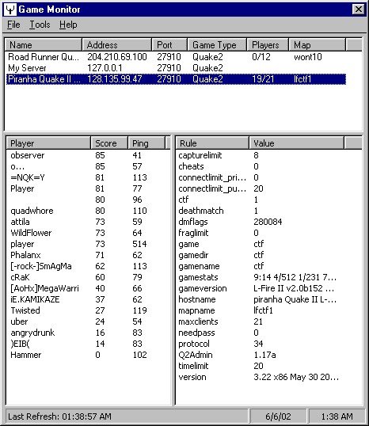



## Game Server Monitor

### Description

Not sure what happened to my previous post. Anyway, here it is again. Someone had requested a QuakeII and Half-life game server console program. I dug through my drive and found one I'd wrote for myself a long time ago. I dusted it off and cleaned it up. Please be gentle. This is my 1st submission to this terrific site. I didn't prefer using the registry to store the server info but I was trying to keep the code small and not use a database. The app works with Q2 and Q3 right now. I'll try and add the other games later. If you see something broke, let me know and I'll fix it. Votes are greatly appreciated! Thanks. Hope you enjoy.
 
### More Info
 

             |
---                |---
**Submitted On**   |2002-06-07 00:16:08
**By**             |[Scott 2002](https://github.com/Planet-Source-Code/PSCIndex/blob/master/ByAuthor/scott-2002.md)
**Level**          |Intermediate
**User Rating**    |4.0 (16 globes from 4 users)
**Compatibility**  |VB 5\.0, VB 6\.0
**Category**       |[Games](https://github.com/Planet-Source-Code/PSCIndex/blob/master/ByCategory/games__1-38.md)
**World**          |[Visual Basic](https://github.com/Planet-Source-Code/PSCIndex/blob/master/ByWorld/visual-basic.md)
**Archive File**   |[Game\_Serve91272672002\.zip](https://github.com/Planet-Source-Code/scott-2002-game-server-monitor__1-35561/archive/master.zip)

